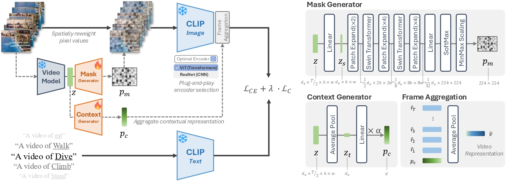

## EV-CLIP: Efficient visual prompt adaptation for CLIP in few-shot action recognition under visual challenges

### Overview

---



This repository provides the official implementation of **EV-CLIP**, an efficient visual prompt adaptation framework for CLIP in few-shot video action recognition under challenging real-world conditions.

While previous CLIP-based approaches for action recognition have mainly focused on temporal modeling, they often overlook the importance of **robust spatial perception**, which becomes critical under visual challenges such as low-light environments and egocentric viewpoints. As highlighted in our paper, such conditions significantly degrade action recognition performance due to impaired visual understanding.

To address this limitation, EV-CLIP introduces a **parameter-efficient and modular adaptation framework** that enhances spatial and temporal representations without modifying the frozen CLIP backbone.

Our approach consists of two key visual prompts:

- **Mask Prompt**  
  Reweights pixel intensities to emphasize action-relevant regions, improving spatial perception under challenging visual conditions (e.g., low illumination, cluttered scenes).

- **Context Prompt**  
  Compresses frame-wise features into a compact representation to provide lightweight temporal modeling and capture global action dynamics.

These prompts are:
- **Plug-and-play** (no architectural modification of CLIP)
- **Backbone-agnostic** (compatible with both CNN and Transformer encoders)
- **Parameter-efficient** (minimal trainable parameters)

Extensive experiments across five benchmark datasets demonstrate that EV-CLIP:
- Achieves **state-of-the-art performance** among parameter-efficient methods
- Shows strong robustness under **domain shifts** (e.g., ARID, EGTEA)
- Maintains favorable trade-offs between **accuracy, efficiency, and scalability**

This makes EV-CLIP a practical solution for real-world video understanding under limited data and resource constraints.

### Setup

---

### 1. Install the conda environment

1. **evoclip.yaml**
    
    ```python
    # Create a new environment
    conda create -n evoclip python=3.10.14
    
    # Activate the environment
    conda activate evoclip
    ```
    
2. **Install requirements**
    
    ```python
    # Install Pytorch
    pip install torch==2.1.2 torchvision==0.16.2 torchaudio==2.1.2 --index-url https://download.pytorch.org/whl/cu118
    
    # pip install the requirements.txt
    pip install -r requirements.txt
    ```
    
3. **CLIP**
    
    ```python
    pip install git+https://github.com/openai/CLIP.git
    ```
    
4. **Movinets**
    
    ```python
    pip install git+https://github.com/Atze00/MoViNet-pytorch.git
    ```
    
5. **OpenCV**
    
    ```python
    pip install opencv-python
    ```
    

### 2. Prepare the datasets

- **UCF101**
    
    For the identical shot settings, download the shot lists [here](https://github.com/muzairkhattak/ViFi-CLIP/tree/main/datasets_splits/ucf_splits) and save them with making a new directory. The location of this directory should be applied to ***self.split_path*** variable in “*~/EVoCLIP/datasets/ucf101_video_vifi.py*” before starting the training.
    
    [Download Link](https://www.crcv.ucf.edu/data/UCF101.php)

- **HMDB51**
    
    For the identical shot settings, download the shot lists [here](https://github.com/muzairkhattak/ViFi-CLIP/tree/main/datasets_splits/hmdb_splits) and save them with making a new directory. The location of this directory should be applied to ***self.split_path*** variable in “*~/EVoCLIP/datasets/hmdb51_vifi.py*” before starting the training.
    
    [Download Link](https://serre-lab.clps.brown.edu/resource/hmdb-a-large-human-motion-database/#Downloads)
    
- **ARID**
    
    [Download Link](https://xuyu0010.github.io/arid.html#papers-and-download)
    
- **EGTEA Gaze+**
    
    [Download Link](https://cbs.ic.gatech.edu/fpv/)

- **EK100**
    
    [Download Link](https://github.com/epic-kitchens/epic-kitchens-100-annotations/blob/master/README.md#erratum)

The data splits are provided in “*~/EVoCLIP/shots*”

You can find the repositories of comparative methods below. We conducted our experiments following the [ViFi-CLIP](https://github.com/muzairkhattak/ViFi-CLIP).

- [ViFi-CLIP](https://github.com/muzairkhattak/ViFi-CLIP)
- [EZ-CLIP](https://github.com/Shahzadnit/EZ-CLIP)
- [AIM](https://github.com/taoyang1122/adapt-image-models)
- [ST-Adapter](https://github.com/linziyi96/st-adapter)

### Train

---

```bash
# Train the model.
sh ./scripts/evoclip/evo-true_coop-false2.sh 0 arid omniS_vit_b16 8 4 768 Both Consistency_Loss 0.1 mean_pool
```

**Configs**

1. **script file**
    
    Before you start training, you should set the “***DATA***”, “***SHOT_DIR***” first. These indicates the dataset location and location to save shot lists, respectively.
    
    - evo-true_coop-false1.sh : Train EVo-CLIP with a single seed.
    - evo-true_coop-false2.sh : Train EVo-CLIP with two seeds.
    - evo-true_coop-false.sh : Train EVo-CLIP with three seeds.
2. **GPU**
    
    Set your GPU(Cuda) number to use for training.
    
3. **Dataset**
    
    Available Dataset List: ucf101_vifi, arid, egtea
    
    - ucf101_video_vifi : Train for the first split of UCF101 dataset, using identical shot samples with [ViFi-CLIP](https://github.com/muzairkhattak/ViFi-CLIP) and [EZ-CLIP](https://github.com/Shahzadnit/EZ-CLIP).
    - hmdb51_vifi : Train for the first split of HMDB51 dataset, using identical shot samples with [ViFi-CLIP](https://github.com/muzairkhattak/ViFi-CLIP) and [EZ-CLIP](https://github.com/Shahzadnit/EZ-CLIP).
    - arid: Train for the two splits of ARID dataset, which features dark scene conditions.
    - egtea: Train for the three splits of EGTEA Gaze+ dataset, which features egocentric viewpoints.
4. **Config File**
    
    Select a config file in “~/EVo-CLIP/configs/trainers/***dataset/filename.yaml***”.
    
    In the command line, set the name as “***filename***”.
    
5. **The number of Frames**
    
    ex) 2, 4, 8, 16, …
    
6. **The number of Shots**
    
    ex) 2, 4, 8, 16, …
    
7. **The channel dimension size extracted from the video model.**
    - Omni-Tiny , Omni-Small: 768
    - Omni-Base: 1024

8. **Prompt Choice**
    - Mask : only the mask prompt
    - Context : only the context prompt
    - Both : both prompts

9. **Loss**
    - Cross_Entropy: Cross Entropy Loss
    - Consistency_Loss: Cross Entropy Loss + lambda*Consistency Loss

10. **Lambda**
    - Lambda value that controls the influence of the Consistency Loss

11. **Temporal Aggregation**
    - “***mean_pool***” is the only and defualt setting.

### Evaluation

---

```bash
# Evaluate the downloaded model.
# path example) "output/ucf101" for "~/EVoCLIP/output/ucf101/seed1/model/model-best.pth.tar
sh ./scripts/evoclip/eval_downloaded.sh 0 arid omniS_vit_b16 8 4 "path"

# Evaluate the model which you trained by yourself.
sh ./scripts/evoclip/eval.sh 0 arid omniS_vit_b16 8 4
```

1. **script file**
    
    Before you start the evaluation, you should set the iteration number for each dataset in the file.
    
    - eval.sh
    
2. **GPU**
    
    Set your GPU(Cuda) number to use for training.
    
3. **Dataset**
    
    Available Dataset List: ucf101_video_vifi, arid, egtea
    
    - ucf101_video_vifi : Train for the first split of UCF101 dataset, using identical shot samples with [ViFi-CLIP](https://github.com/muzairkhattak/ViFi-CLIP) and [EZ-CLIP](https://github.com/Shahzadnit/EZ-CLIP).
    - arid: Train for the two splits of ARID dataset, which features dark scene conditions.
    - egtea: Train for the three splits of EGTEA Gaze+ dataset, which features egocentric viewpoints.

4. **Config File**
    
    Select a config file in “~/EVo-CLIP/configs/trainers/***dataset/filename.yaml***”.
    
    Don’t forget to set the name as “***filename***”.
    
5. **The number of Frames**
    
    ex) 2, 4, 8, 16, …
    
6. **The number of Shots**
    
    ex) 2, 4, 8, 16, …

7. **The path of downloaded weights**
    
    ex) "output/ucf101" for "~/EVoCLIP/output/ucf101/seed1/model/model-best.pth.tar


### Model Zoo

---
Download the weights for the trained models. Each Model was trained on the first seed of respective dataset. Make a directory such as "EVoCLIP/weights/ucf101", and save the weight as "EVoCLIP/weights/ucf101/model/model-best.pth.tar". The evaluation should be conducted using "eval_downloaded.sh", with the path "weights/ucf101".

**K400(Kinetics-400)**
- Post-pretrained Zero-shot Model.

| VM \ CLIP | ViT-B/16 |
| --- | --- |
| Omnivore-Small | [Link](https://drive.google.com/file/d/1tizKBf8Ol0-K9OhlytRI4OiRblxy0l7E/view?usp=sharing) |

**UCF101**
- Few(eight)-shot Model.

| VM \ CLIP | ViT-B/16 |
| --- | --- |
| Omnivore-Small | [Link](https://drive.google.com/file/d/1mrWH6_oTurb3OGBJ88BNQYfoBrqHbr6A/view?usp=sharing) |

**HMDB51**
- Few(eight)-shot Model.

| VM \ CLIP | ViT-B/16 |
| --- | --- |
| Omnivore-Small | [Link](https://drive.google.com/file/d/1AD3skVlj6ERkqD5eSqhLoHh4AZQpztx9/view?usp=sharing) |

**ARID**
- Few(eight)-shot Model.

| VM \ CLIP | ViT-B/16 |
| --- | --- |
| Omnivore-Small | [Link](https://drive.google.com/file/d/1zrx6VX_siBJuVNZty0V_OSlS_347MQf2/view?usp=sharing) |

**EGTEA**
- Few(eight)-shot Model.

| VM \ CLIP | ViT-B/16 |
| --- | --- |
| Omnivore-Small | [Link](https://drive.google.com/file/d/1r0Iayiadyx7lB_ie_VCXHnuO5i07xPs1/view?usp=sharing) |

### Acknowledgements

---

This code is based on [Dassl](https://github.com/KaiyangZhou/Dassl.pytorch).


### Citation

---

If you find this work useful, please consider citing:

```bibtex
@article{jon2026evclip,
  title={EV-CLIP: Efficient Visual Prompt Adaptation for CLIP in Few-Shot Action Recognition under Visual Challenges},
  author={Jon, Hyo Jin and Jin, Longbin and Kim, Eun Yi},
  journal={arXiv preprint arXiv:XXXX.XXXXX},
  year={2026}
}